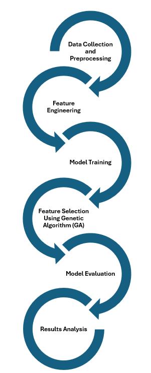
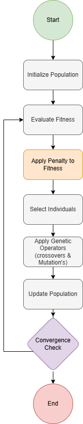
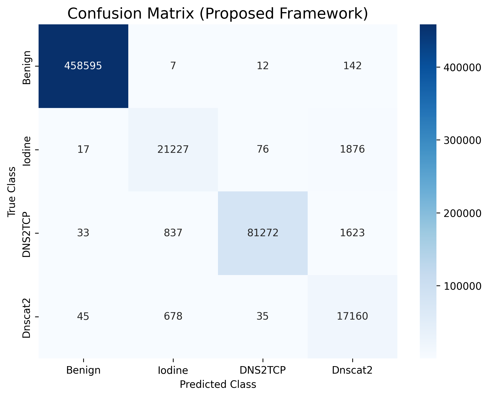
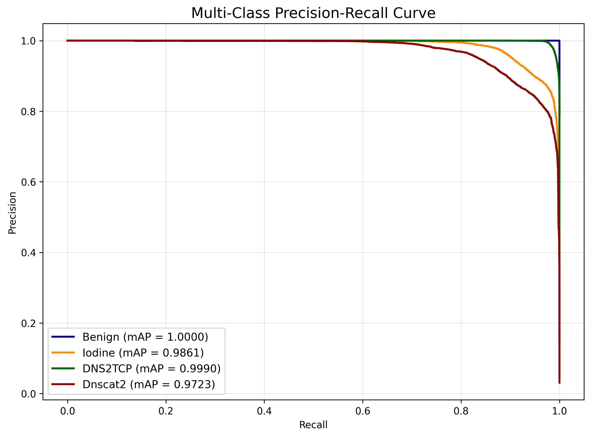
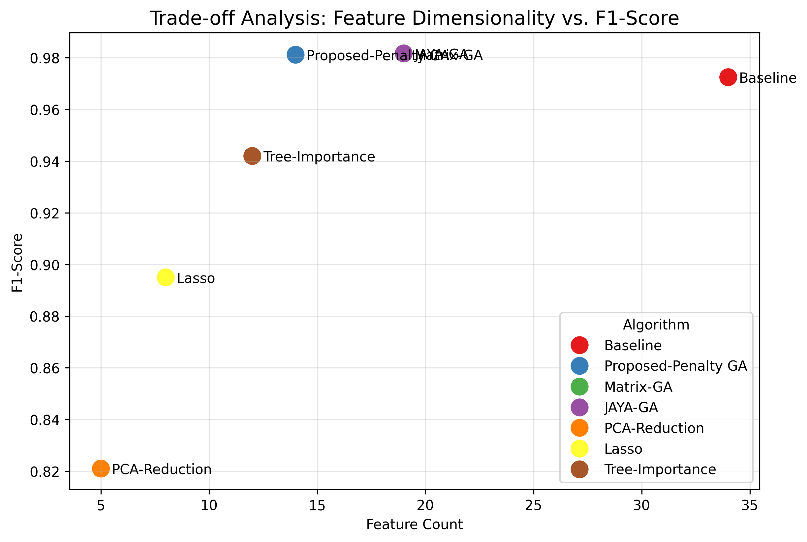
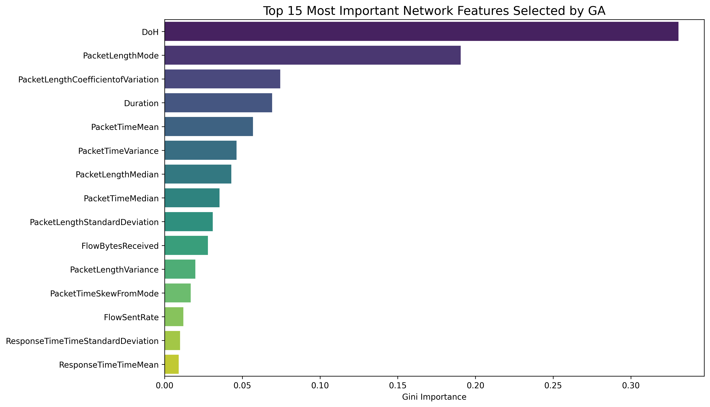
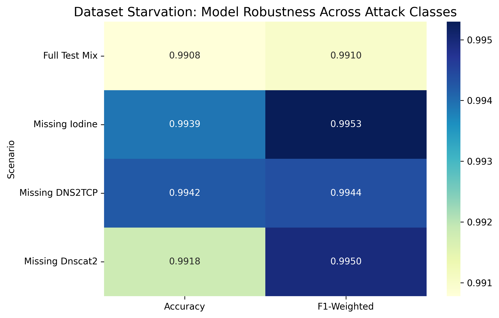
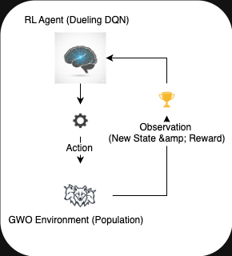

# 📁 Media Catalog: DNS Tunneling Detection Project

This directory serves as the central visual repository for the PhD research project. Below is a categorized catalog of all figures and assets used in the paper, documentation, and presentations.

---

## 🏗️ 1. Methodology & Logic
Detailed visualizations of the proposed GA-RF hybrid framework.

| Figure | Description |
| :--- | :--- |
|  | **End-to-End Pipeline**: From raw traffic capture to classification. |
|  | **Adaptive Penalty GA**: The evolutionary logic of feature optimization. |
|  | **Data Preprocessing**: Handling missing values, scaling, and variance filtering. |

---

## 📈 2. Experimental Results
Performance benchmarks and diagnostic plots.

### 🏁 Performance Dashboards
|  |  |
|:---:|:---:|
| **Confusion Matrix** | **PR Curve Analysis** |

### 🔍 Optimization & Trade-offs
| Figure | Description |
| :--- | :--- |
|  | **Pareto sweet spot**: Accuracy vs. Feature count. |
|  | **Gini Importance**: Ranking the most discriminative behavioral features. |
|  | **Robustness Heatmap**: Model resilience under class starvation scenarios. |

---

## 🔬 3. Supplementary Analysis
Deep dives into the Genetic Algorithm behavior and dataset characteristics.

| Figure | Description |
| :--- | :--- |
|  | **Class Balance**: Visualization of benign vs. malicious traffic distribution. |
|  | **GA Convergence**: Optimization progress over 100 generations. |
|  | **RL Loop**: Feature engineering feedback mechanism. |

---

## 👥 4. Research Team
The core contributors behind this research.

|  |  |  |
|:---:|:---:|:---:|
| **Mahmoud Sammour** | **Dr. Mohd Fairuz** | **Mohsin Ali** |

|  |  |
|:---:|:---:|
| **Dr. Aslinda Hassan** | **Prof. M. Hanafi** |

---

> [!NOTE]
> All images are available in high resolution for publication use. Please reference the [main README](../README.md) for citation details.
